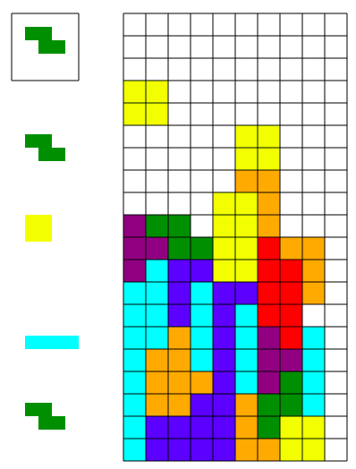

# Tetris

Implementation of Tetris that I whipped up in JavaScript. There's no scoring.
You can't win. You can't lose. It's some sort of nihilist metaphor, perhaps
(?) ... or a toy to waste your brain's (and your CPU's) cycles on.

<!--
TODO: GET URL WORKING WHEN THIS IS PUBLIC!
-->
* Because of the magic of JS, you can
  [run it in your browser](https://a/url/here); you
  *know* that you have CPU cycles to spare!
